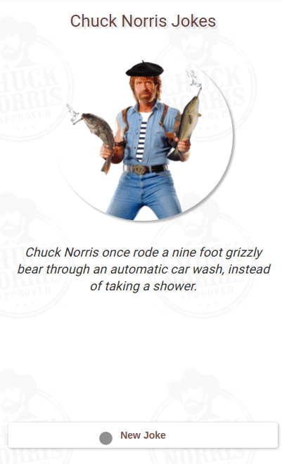

<h1>Chuck Norris Jokes</h1>



See some jokes about Chuck Norris and have fun !)

https://alvescleiton.github.io/chuck-norris-jokes

--- 

## Tools
* React

## Clone and Run
```bash
# clone the project
git clone https://github.com/alvescleiton/chuck-norris-jokes.git
```

```bash
# install dependencies
npm install
```

```bash
# run the project
npm run start
```

## Contribute
Contribute to the project by adding new features or fixes!

## License
<a href="https://opensource.org/licenses/MIT"></a>